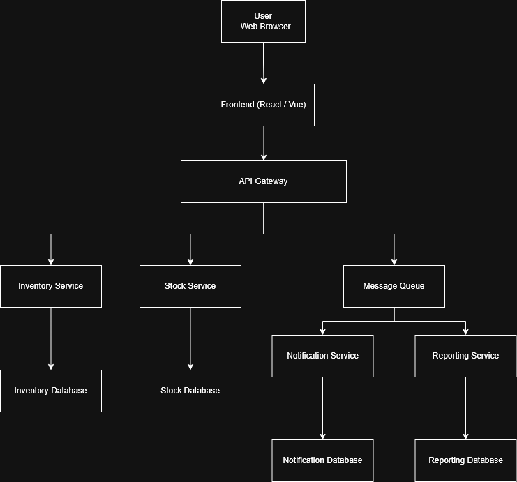

## Candidate Architecture 2: Microservices Architecture

### Overview

สถาปัตยกรรมแบบ Microservices จะเป็นการแยกระบบออกเป็นบริการย่อยๆ ตามหน้าที่ เช่น จัดการสินค้า สต็อก และการแจ้งเตือน ช่วยให้ระบบสามารถขยายตัวได้ดีและรองรับผู้ใช้งานจำนวนมาก โดยจะเหมาะกับระบบที่มีการเติบโตในอนาคต

### Components

* API Gateway
* Inventory Service
* Stock Transaction Service
* Notification Service
* Reporting Service
* Message Queue
* Databases (แยกตามแต่ละ Service)

### Technology Stack

* Frontend: React 
* Backend: Node.js 
* Database: PostgreSQL / MongoDB (แยกแต่ละ Service)
* Others: Docker, REST API, Message Queue

### Architectural Patterns

* Microservices Pattern
* Event-Driven Architecture
* API Gateway Pattern
* Database per Service

### Diagram

### Pros & Cons

**Pros:**

* ✅ รองรับ Scalability ได้ดี เนื่องจากแต่ละ Service แยกการทำงานอย่างอิสระ
* ✅ ลดการเชื่อมต่อโดยตรงระหว่าง Service ด้วยการใช้ Message Queue
* ✅ Reporting และ Notification ไม่กระทบต่อประสิทธิภาพของระบบหลัก

**Cons:**

* ❌ โครงสร้างระบบซับซ้อนกว่าสถาปัตยกรรมแบบ Monolith
* ❌ ต้องใช้ความรู้ด้าน Event-driven และ DevOps เพิ่มเติม
* ❌ ใช้เวลาในการพัฒนาและดูแลระบบมากขึ้น
